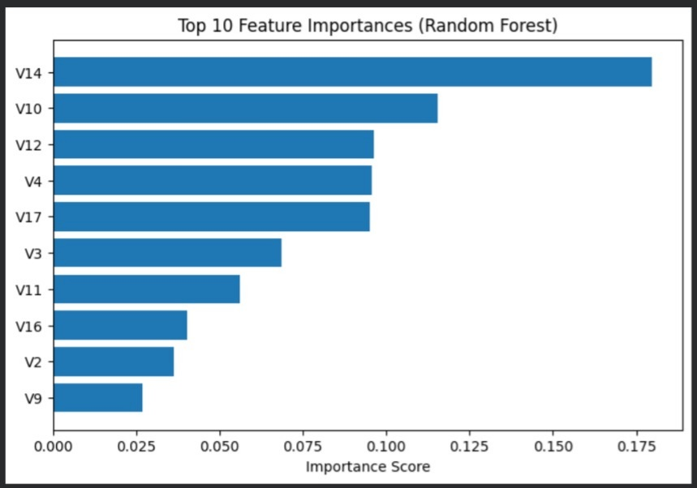

# 🔍 Task 9: Random Forest – Credit Card Fraud Detection

This project is part of the **AI & ML Internship (Task 9) at the Elevate Labs** and focuses on detecting fraudulent credit card transactions using **ensemble learning**, specifically the **Random Forest algorithm**.  
The task emphasizes handling **highly imbalanced datasets** and using appropriate evaluation metrics beyond accuracy.

---

## 📌 Objective

- Detect fraudulent credit card transactions
- Handle severe class imbalance
- Compare a baseline model with an ensemble model
- Identify important fraud indicators
- Save the trained model for future reuse

---

## 📂 Dataset

- **Source:** Kaggle – Credit Card Fraud Detection Dataset  
- **Description:**
  - Contains transactions made by credit cards
  - Features `V1` to `V28` are anonymized (PCA transformed)
  - `Class` column:
    - `0` → Non-Fraud
    - `1` → Fraud
- **Key Challenge:** Extreme class imbalance (fraud ≈ 0.17%)

---

## 🛠️ Tools & Libraries Used

- Python
- Pandas
- NumPy
- Scikit-learn
- Matplotlib
- Joblib

---

## 🧪 Methodology

### 1️⃣ Data Loading & Exploration
- Loaded dataset and analyzed class distribution
- Identified extreme imbalance between fraud and non-fraud cases

### 2️⃣ Data Preparation
- Separated features (`X`) and target (`y`)
- Applied **stratified train-test split** to preserve fraud ratio

### 3️⃣ Baseline Model – Logistic Regression
- Used as a comparison model
- Applied `class_weight='balanced'`
- Observed:
  - High recall
  - Very low precision for fraud class

### 4️⃣ Final Model – Random Forest Classifier
- Used ensemble learning with multiple decision trees
- Parameters:
  - `n_estimators = 100`
  - `class_weight = 'balanced'`
- Achieved a better balance between precision and recall

---

## 📊 Feature Importance

The Random Forest model provides feature importance scores, helping identify key indicators of fraudulent activity.

### 🔝 Top Fraud-Influencing Features



> Features such as **V14, V17, V12, and V10** were among the most influential in detecting fraud.

---

## ⚖️ Model Comparison Summary

| Model | Fraud Precision | Fraud Recall | Fraud F1-Score |
|------|----------------|--------------|----------------|
| Logistic Regression | Low | High | Low |
| Random Forest | High | High | High |

✔ Random Forest clearly outperformed Logistic Regression on imbalanced data.

---

## 💾 Model Saving

- The trained Random Forest model was saved using **joblib**:

```text
random_forest_fraud_model.pkl
```

- This allows reuse of the model without retraining.

---

## 📁 Repository Structure

```text
AI-ML-Internship-Task-9/
│
├── assets/
│   └── Feature_Importance_Plot.png
│
├── Task_9_Random_Forest.ipynb
├── random_forest_fraud_model.pkl
├── README.md
```

---

## 🎯 Final Outcome

- Learned how to handle **imbalanced datasets**
- Understood why **accuracy is misleading** in fraud detection
- Gained hands-on experience with **ensemble learning**
- Successfully identified key fraud indicators

---

## 🧠 Interview Questions Covered

- Why is accuracy misleading in fraud detection?
- What is Random Forest?
- What is ensemble learning?
- What is `n_estimators`?
- What is SMOTE?

---

### ✅ Task 9 Completed Successfully 🚀

---
